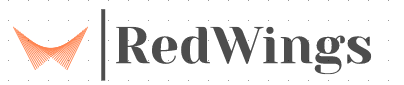

A database management web application for managing blood banks,donors and recepients and finding the nearest blood banks.

Homepage
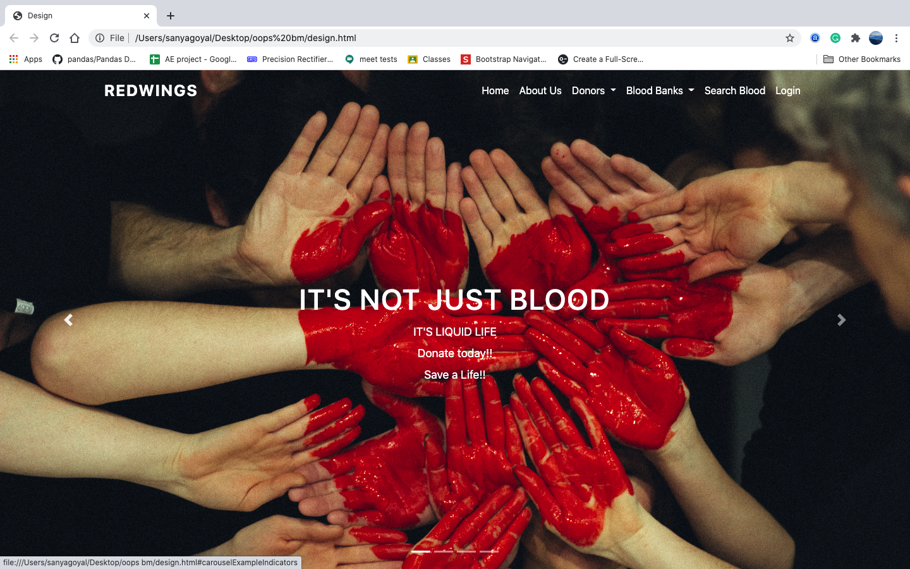
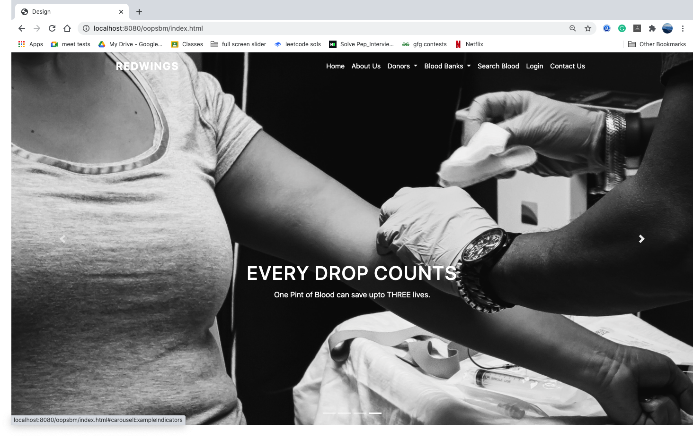
About Us Page
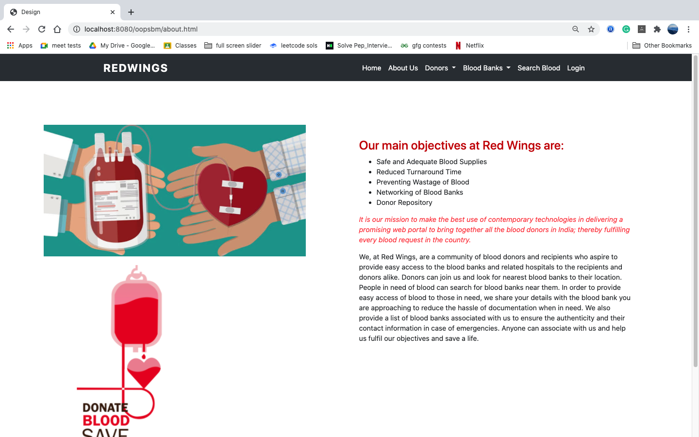
Why Donate page
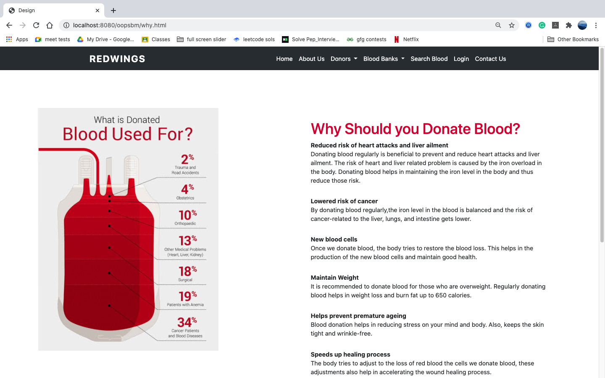
Multistep form for Donor Registration
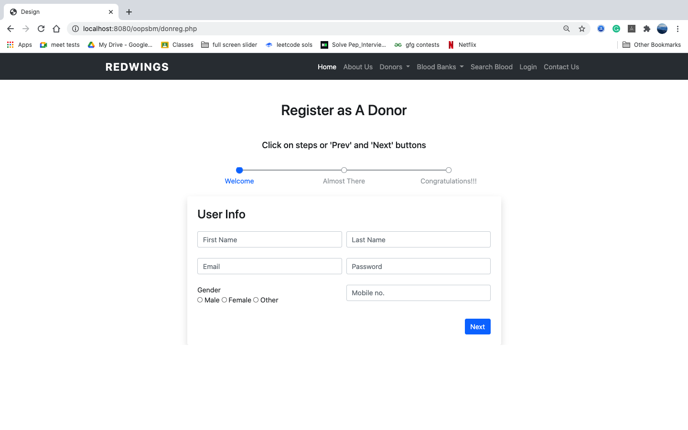
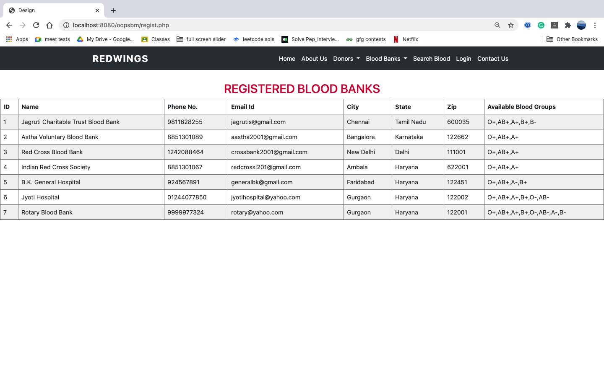
Registration form for Blood Banks
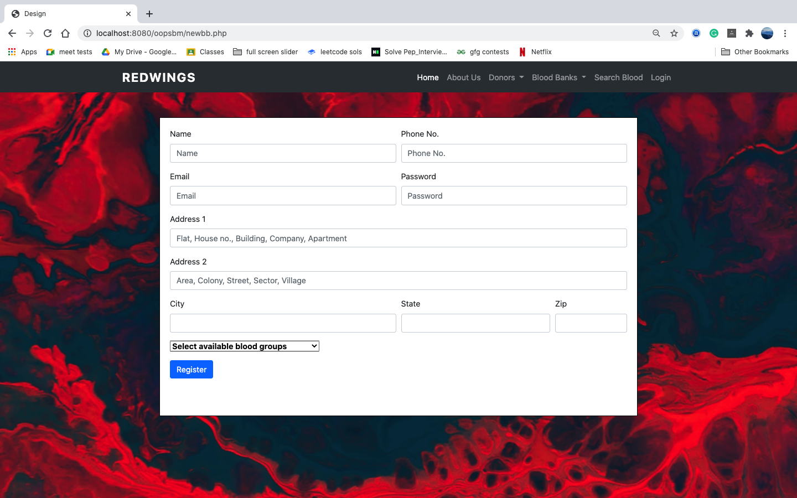
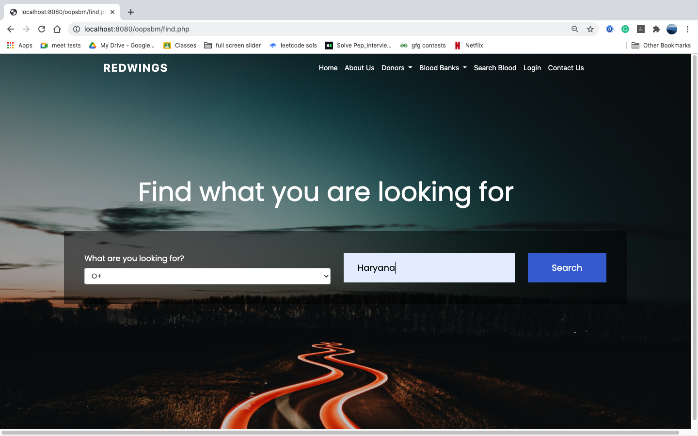
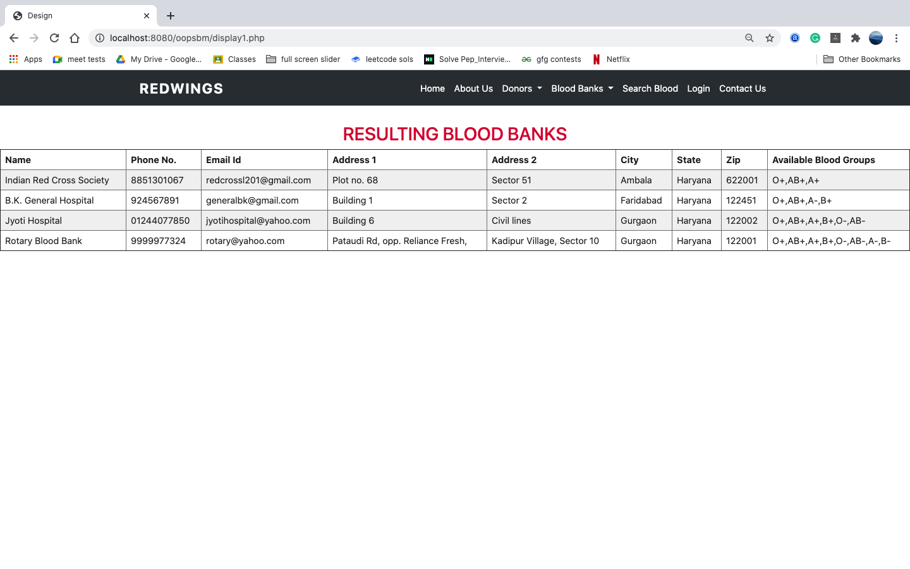
Find the blood banks in google map
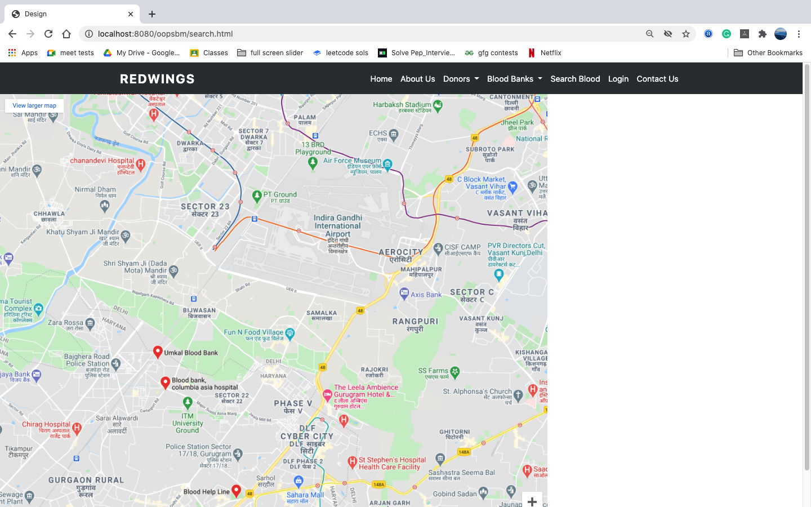

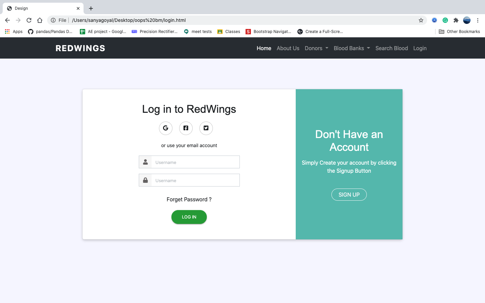
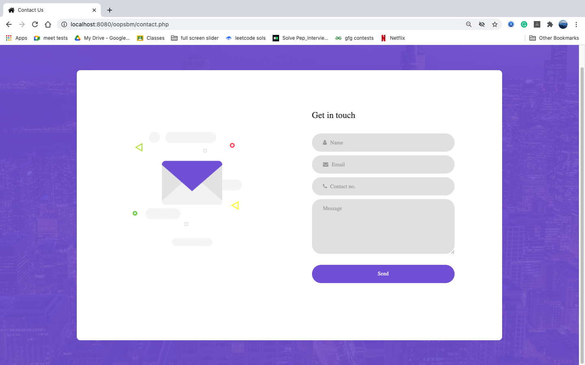

Admin Dashboard
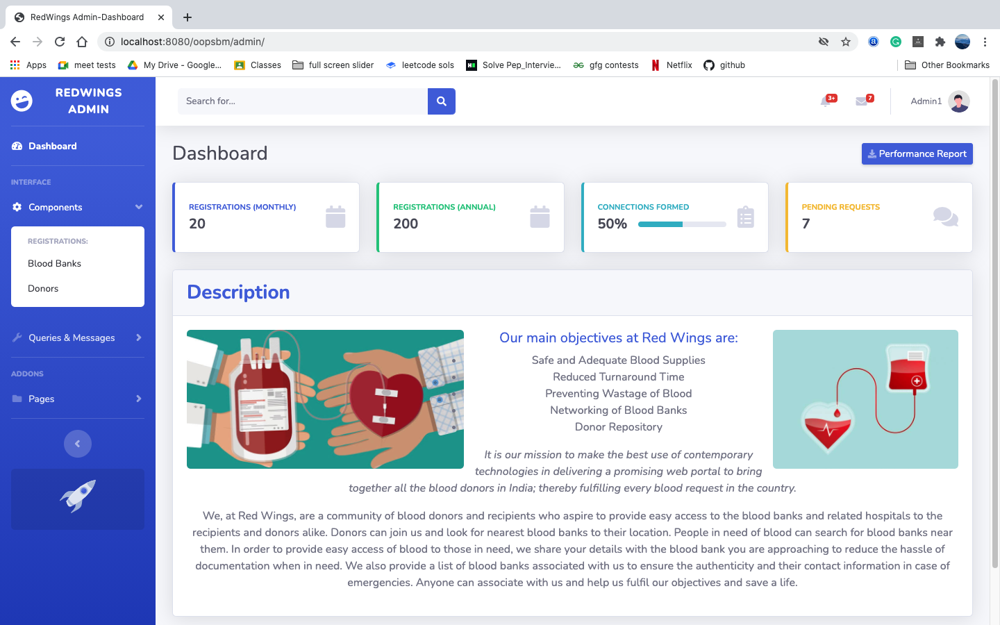
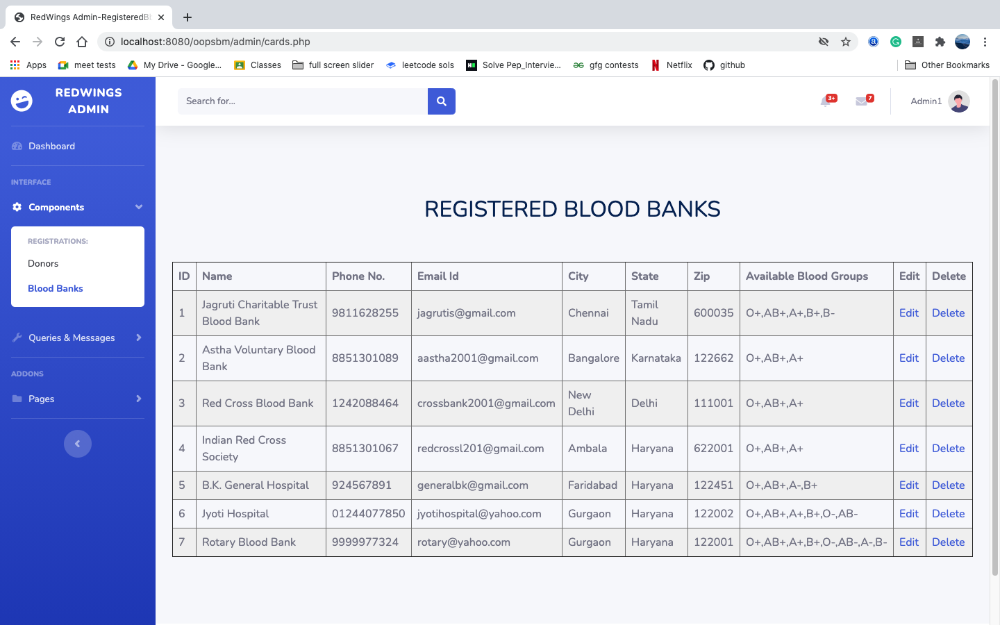

https://sanyagoyal2000.github.io/RedWings-Project/     (Link of the web app)

The project also contains a dashboard for admins to edit the information of donors and bloodbanks and acts as a link between the two as well.Helps bloodbanks approach the donors if required.The donor information is not publicly available
